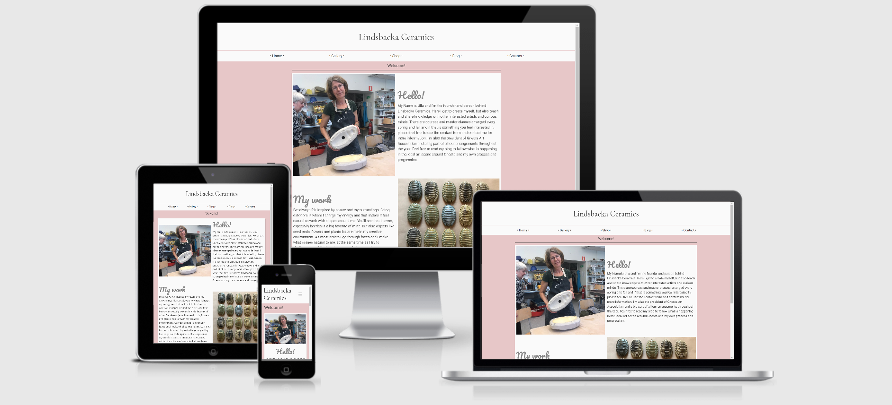

# Lindsbacka Ceramics

A presentation of Ulla Ceder's creations under the name Lindsbacka Ceramics. Essentially a platform to display her work, including contacts for purchase and visits. Also information on the courses that are being held throughout the year, and other creative projects that Ulla is part of.

Hosts: [GitHub Pages](https://matsceder.github.io/first-milestone-project/index.html)  
Repository: [GitHub](https://github.com/matsceder/first-milestone-project)

## UX
------

### User Stories
I'm expecting users coming here for different reasons, but mostly either with interest in buying or learning more them selves. I categorize the users according to the following list.
- An everyday user with general interest in ceramics being curious.
- A user looking to visit and/or buy creations.
- Users wanting to learn how to do it them selves, looking for a course.
- Other artist users looking for inspiration or contact for collaboration.

### Design and Mockups
My mockups are made using [Figma](http://www.figma.com). For the colors I've used [Color Scheme Designer 3](https://http://colorschemedesigner.com/csd-3.5/) as my tool, and choices are based on the colors of pottery clay. Fonts used on the page are Cormorant, Pacifico and Roboto.  

You can see my mockups here, divided by device: 
[Mobile](https://www.figma.com/file/Rs1JPq8VtGmXcZ8g5SUKJRJr/First-milestone-project?node-id=0%3A1),
[Tablet](https://www.figma.com/file/Rs1JPq8VtGmXcZ8g5SUKJRJr/First-milestone-project?node-id=1%3A10),
[Desktop](https://www.figma.com/file/Rs1JPq8VtGmXcZ8g5SUKJRJr/First-milestone-project?node-id=6%3A121).

## Features
Implemented features, and ideas for additional features.
### Existing Features
- Responsive design - Mobile first application
- Documentation - ReadMe.md and Mockups
- HTML and CSS based development
- Bootstrap and BootstrapCDN - HTML, CSS frameworks and JS-based design templates
    - Layout - Containers and grid system
    - Dropdown
    - Icons 
    - JS - Alert box
    - Buttons
    - Forms
- Responsive design - Mobile first
- GitHub - Remote repository and deployment

### Features to implement or improve
- Git - Version control system
- Documentation - License
- Payment gateway - For putchases online
- JavaScript - For better UX

## Technologies used
- [HTML](https://developer.mozilla.org/en-US/docs/Web/HTML)
    - Used for the strucure of the page
- [CSS](https://developer.mozilla.org/en-US/docs/Web/CSS)
    - Used for styling
- [JavaScript](https://www.javascript.com/)
    - JS is used for dynamic functionallity
- [JQuery](https://jquery.com)
    - JQuery is used to simplify DOM manipulation
- [GitHub](https://github.com/)
    - Is the service used for hosting my repository
- [GitHub Pages](https://pages.github.com/)
    - Used for hosting the website
- [Google Chrome](https://www.google.com/chrome/)
    - Chrome has been used for browsing and Dev Tools
- [Google](https://www.google.com/)
    - Used for research
- [Google Fonts](https://fonts.google.com/)
    - Is where I found the fonts used in the page
- [Bootstrap](https://getbootstrap.com/)
    - Bootstrap is where I got the HTML and CSS frameworks
- [Color Scheme Designer 3](https://http://colorschemedesigner.com/csd-3.5/)
    - Used for picking colors throughout the page
- [Am I Responsive](http://ami.responsivedesign.is)
    - Testing of the site to make sure it's responsive
- [The W3C Markup Validation Service](https://validator.w3.org/)
    - For testing of all the HTML and CSS, looking for flaws in the code
- [Font Awesome](https://fontawesome.com/)
    - Icons used on the page was found here
- [CSSmatic](https://cssmatic.com/)
    - For added effects and nice design

## Testing
Since this is a simple landing page, the site has gone through manual testing. And after that it has had the code validated.
### First Test - Manual testing in Chrome Dev Tools
Using Dev Tools, checking booth responsiveness, navigation and links. One screen size at a time.
- Mobile 
    - Design and responsiveness - Making sure everything looks the way it should. Since the site was made for mobile first, this one worked out really well from the start.
    - Links and Buttons - Making sure links and buttons take you where they should
    - Navigation - Testing the dropdown navigation, making sure it's visible and the navbar for larger screens is hidden
    - Tested the "Send"-button in the contact form making sure the Alert is displayed as it should
- Tablet (Normal and bigger)
    - Design and responsiveness - Making sure everything looks the way it should. Margins and the layout didn't respond in the dessired way in the beginning and the code had to be changed for a nicer look
    - Links and Buttons - Making sure links and buttons take you where they should
    - Navigation - Testing navigation, making sure it's visible and that the dropdown for mobile screens is not visible
    - Tested the "Send"-button in the contact form making sure the Alert is displayed as it should
- Desktop (Laptop and large screen resolution)
    - Design and responsiveness - Making sure everything looks the way it should. The index and contact page ended up not being good enough in the beginning and had to be adjusted
    - Links and Buttons - Making sure links and buttons take you where they should
    - Navigation - Testing navigation, making sure it's visible and that the dropdown for mobile screens is not visible
    - Tested the "Send"-button in the contact form making sure the Alert is displayed as it should

### Second Test - Validation of code using W3C Markup Validation Service
- Testing HTML
    - Pasted the url of each individual page for validation. A few minor errors in the code was discovered and corrected.
- Testing CSS
    - Pasted the complete CSS code in the "Validate by direct input"-section. No problems found

## Deplyment

## Credits

### Content

### Media

### Acknowledgements

sources and credits to

Seun
Code Institute
Bootstrap
W3School
Font Awesome
stackoverflow
cssmatic
My mom - Ulla Ceder and her instagram, for picure sources
http://ami.responsivedesign.is/#

https://alligator.io/css/cropping-images-object-fit/
https://www.freecodecamp.org/news/how-to-keep-your-footer-where-it-belongs-59c6aa05c59c/

market picures from 
https://kryssningpolen.se/julmarknad-i-gdansk-2019/
https://www.aftonbladet.se/resa/a/Kv40bo/har-ar-sveriges-basta-julmarknader

